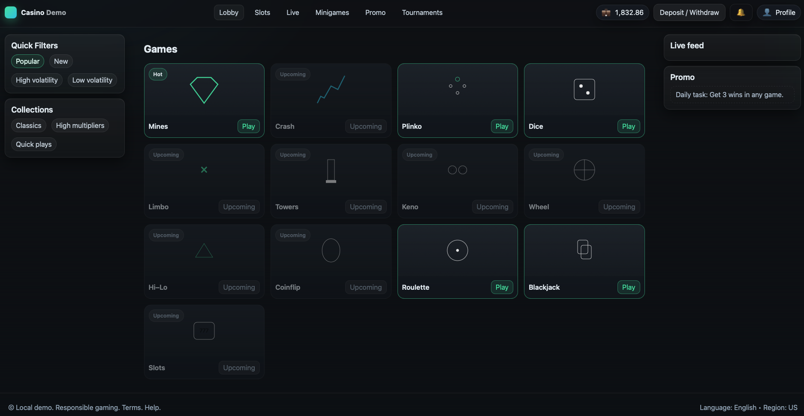

<div align="center">

# 🧪 cas — Educational Static Web (HTML/CSS/JS)

**A small, static sandbox for UI experiments and mini‑games.**  
_No backend. No databases. Just HTML/CSS/JS._

[](#)
[](#)
[](#license)

</div>

> **Educational purposes only.** This repository is a learning playground. It **does not handle money**, **does not provide real gambling**, and **must not** be used in production.

---

## 🔗 Quick links
- **Open the app:** just open [`index.html`](./index.html) in a browser (or via a local server).
- **Run locally:** [`Getting started`](#-getting-started)
- **How it works:** [`Infrastructure`](#-infrastructure-architecture)
- **Project layout:** [`Structure`](#-project-structure)
- **Deploy (Pages):** [`Deployment`](#-deployment-github-pages)
- **Contribute:** [`CONTRIBUTING`](#-contributing)
- **License:** [`MIT`](#-license)

---

## 🚀 Getting started

You can simply open `index.html`. For best results, use a local HTTP server (some browsers restrict module/asset loading from `file://`).

**Option A — Python (built‑in):**
```bash
python3 -m http.server 8080
# then visit http://localhost:8080
```

**Option B — Node (npx):**
```bash
npx serve -p 8080 .
```

Once running, the server usually serves `index.html` from the project root.

---

## 🏗️ Infrastructure (Architecture)

This project is intentionally simple so you can focus on the UI and logic:

- **Static‑only frontend**: pure **HTML/CSS/JS** — no backend and no database.
- **Entry point**: `index.html` loads styles and scripts and links to modules/pages.
- **Modules/pages**: features (e.g., mini‑games) live in separate HTML/JS files and are linked from the index.
- **Client‑side state**: kept in the browser (in‑memory). For demo persistence, use `localStorage`/`sessionStorage` if needed.
- **Local assets**: images/fonts/audio live in this repo and are referenced via relative paths (no external CDNs by default).
- **Security**: no auth, no payments; do not use for real users or production data.
- **Hosting**: any static server works (GitHub Pages, Netlify, Nginx/Apache).

<details>
<summary><strong>Why a local server?</strong></summary>

Some browsers block ES module imports or asset fetches when opened from `file://`.  
Running a local server (`http://localhost`) avoids these restrictions and mirrors real hosting.
</details>

---

## 🗂️ Project structure

A typical layout (yours may vary):

```
.
├─ index.html         # entry point
├─ css/               # stylesheets
├─ js/                # scripts / modules
├─ games/             # optional: self‑contained pages/modules
└─ assets/            # optional: images / fonts / audio
```

> Keep it flat and modular. If a feature grows, give it its own subfolder.

---

## 📦 Deployment (GitHub Pages)

1. Push to GitHub (default branch `main`).
2. In **Settings → Pages**, set **Build and deployment → Source: GitHub Actions**.
3. Commit a Pages workflow (e.g. `.github/workflows/pages.yml`).  
   After a successful run, your site will be available at a URL like  
   `https://<your-user>.github.io/<repo-name>/`.

> If you use a custom domain, add a root `CNAME` file with your domain.

---

## 💡 Tips for contributors
- Small, focused pull requests are easiest to review.
- Add screenshots/GIFs when changing UI behavior.
- Keep code consistent (use Prettier/EditorConfig if available).

---

## 🤝 Contributing

Contributions are welcome! Please open an issue or a pull request.  
If present, check [`CONTRIBUTING.md`](./CONTRIBUTING.md) for guidelines.

---

## 📝 License

<a id="license"></a>
Released under the **MIT License**. See [`LICENSE`](./LICENSE) for details.

---

### 📷 Screenshots

```md

```

